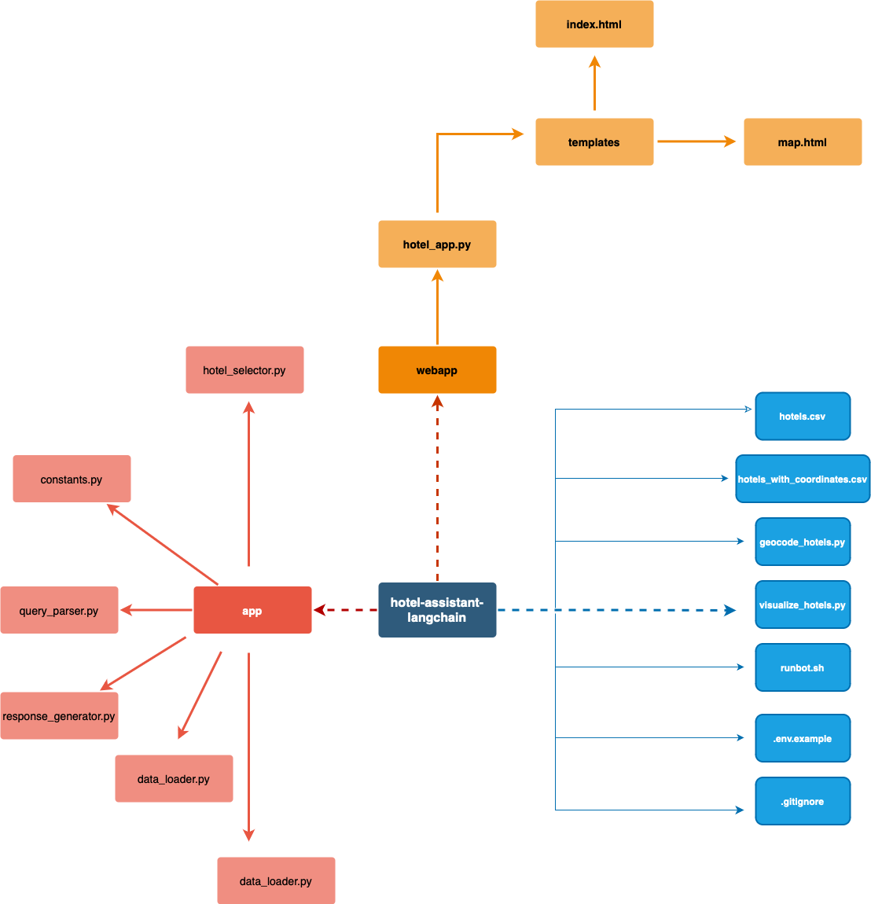
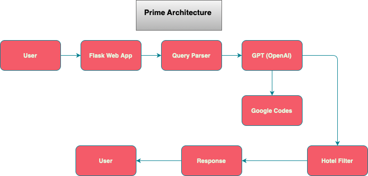

# PrimeBot: Smart Hotel Booking Assistant

PrimeBot is a conversational hotel recommendation assistant built using OpenAI's GPT model, Flask, and Google Maps API. It allows users to search for hotel options in Mumbai using natural language queries and receive structured responses.

---

## Features

- Conversational AI hotel recommendations based on user queries
- Parses user intent including location, room type, budget, and dates
- Returns structured hotel cards with name, location, rating, reviews, and pricing
- Summarizes the top 2 recommended hotels in natural language
- Option to display hotel map using Google Geocoding
- Modular backend design with separate logic for parsing, selection, and response generation
- Secured API key handling using `.env` files

---

## Tech Stack

- Python 3.10+
- Flask (web framework)
- OpenAI GPT via `openai` SDK
- Google Maps Geocoding API
- Pandas (for data filtering)
- HTML/CSS (UI templating)
- Bootstrap (basic styling)

---

## Project Structure

This visual representation illustrates how the entire folder hierarchy and module flow is structured:

---

## How to Run

1. Clone the repository:
git clone https://github.com/SidNirmal-DS/Prime-Bot.git
cd Prime-Bot

2. Create and activate virtual environment:
python -m venv venv
source venv/bin/activate   # On Windows: venv\Scripts\activate

3. Install dependencies:
pip install -r requirements.txt

4. Create a `.env` file in the root folder with your keys:
OPENAI_API_KEY=your-openai-api-key
GOOGLE_MAPS_API_KEY=your-google-maps-api-key

5. Run the Flask app:
python webapp/hotel_app.py

6. Open browser and visit:
http://127.0.0.1:5055

---

## Sample Query
I want to book a Deluxe room in Mumbai from 2025-06-12 to 2025-06-15

Do not share your real `.env` file. A template is provided as `.env.example`.

## Architecture

Below is the high-level architecture diagram for PrimeBot:

---
## Credits

Developed by Siddharth Nirmal  
[GitHub Profile](https://github.com/SidNirmal-DS)
8. 
